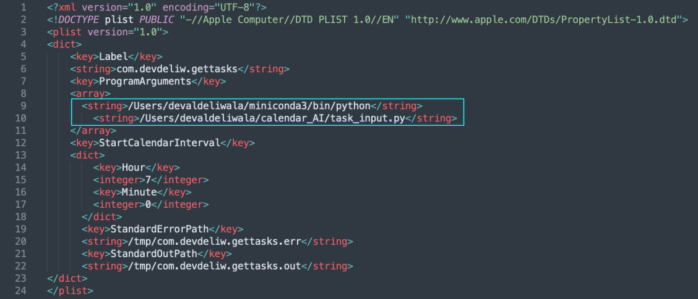
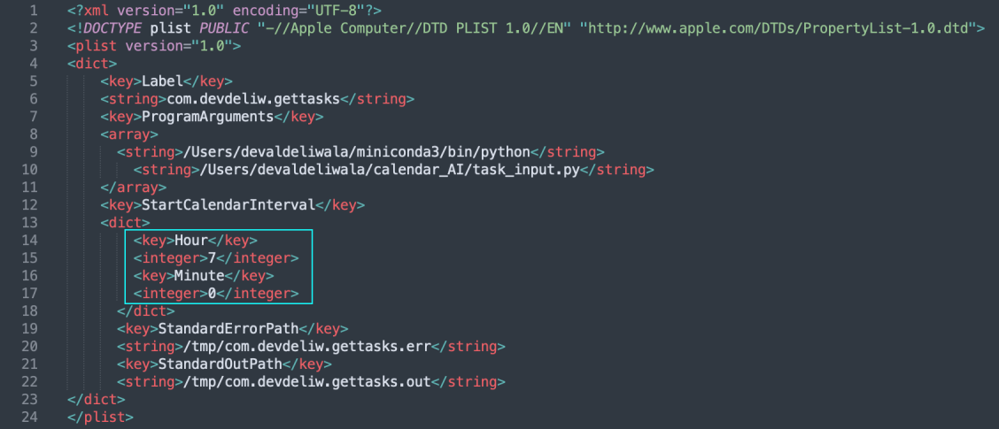

## Elegant Task Scheduling 

#### using Google's text-to-speech (`tts`) and speech-to-text (`sst`) APIs. 

This project was a successful attempt to pseudo-force me into waking up early
every every morning and planning out my day. Here's how it works: 

- Every morning at 7AM the program boots up and **speaks** "Good Morning Deval It's
  currently August 2nd at 7AM! What are your tasks for today?" in a natural
  Google *Studio* Voice. 
- You can then **talk back** to the program stating for example *"Studying
  Quantum Mechanics from 3pm to 6pm."* 
- If the `sst` transcription has a confidence below 90%, it will ask for
  a confirmation to continue to the next task, or allows you to repeat
  yourself otherwise.
- You can state as many tasks as you like. When you say anything like *"That's
  all for today!" or *"I am done"*, the program stores all your spoken tasks and
  updates `LaunchAgents` to the task start times. 
- 30 minutes and 10 minutes before a certain task, the program ***will send you
  an email*** reminding you of the task. When the task begins the program
  reboots and states: *"Studying Quantum Mechanics has begun, you have 3 hours
  remaining*. 
  

## Installation for macOS

This project requires you to create a [Google Cloud Project](https://console.cloud.google.com/welcome) and enable Google's [text-to-speech API](https://console.cloud.google.com/speech/text-to-speech?authuser=1&project=tts-software-431119) and [speech-to-text API](https://console.cloud.google.com/marketplace/product/google/speech.googleapis.com?authuser=1&project=tts-software-431119). 

#### Enabling `sst` API 

---

1. Create a Google Cloud Account using [Google's Cloud Console](https://console.cloud.google.com/welcome/new). 
2. In the Cloud Console, create a `New Project` using the project drop-down
   menu. Enter a project name and input a billing account (* *What we are using
   is free. For both APIs, we get a million characters transcribed free before
   actual payment is required*\*). 
   - Click `Create`
3. Enable the API: 
   - In the Cloud Console, go to the `APIs & Services -> Library`
   - Search for `Text-to-Speech API`. Click Enable. 
4. Authentication: 
   - Go to `APIs & Services -> Credentials`. Click create credentials, then
     select `Service Account`. Fill in the required fields and click `Create.`
     Afterwards assign the `Project -> Editor` role. Skip the sharing users
     section and click `Done`. 
5. JSON Key File: 
   - You should now see the option to download the JSON key file
   - Go to the `Keys` tab from the main home page. Click `Add Key` and select
     `JSON`. 
   - Download the file and save it in a secure location
6. Environment Variable: 
   - Set the environment variable to the path of your JSON key file. 
   - For macOS, for example: add the line 
`export GOOGLE_APPLICATION_CREDENTIALS="path/to/your-service-account-file.json"`
   - to your `~/.zshrc` (or `~/.bashrc` file if you use bash (older macs).
     Afterwards run `source ~/.zshrc` to update the file. 
7. Install Library: 
   - `pip install google-cloud-texttospeech` 
     
The above steps are nearly identical for the speech-to-text API. Instead enable
the `Speech-to-Text API`, create a service account with the role `Cloud Speech
Client`. You do not need to download a new JSON key file and set a new
environment variable. Afterwards just run `pip install google-cloud-speech`. 

This concludes installing the required Google APIs.

---

Now the rest is simple. First run `git clone
https://github.com/devdeliw/automated_task_scheduling` in your terminal. 

1. Place the `plist` folder in your `~/Library/LaunchAgents/` directory. 
2. Within each `.plist` file, you have to change the location to your `python`
   and `.py` files you cloned from this repo. 
   - For example in the `gettasks.plist` file, you should see the following: 
   
 

   - You need to replace the first string `/Users/devaldeliwala/.../python` to the 
     python you use. You also need to replace the second string 
     `/Users/devaldeliwala/.../task_input.py` to your `task_input.py` file in your 
     cloned repo folder. 
   - Additionally, to set the time for the program to ask for your tasks of the
     day, change the following: 
     
 

   - replace it says `7` under 'Hour' and `0` under 'Minute,' with your time.
     For example, to change it to start the `task_input.py` file at 9:30 AM,
     replace `7` with `9`, and `0` with `30`. If, for any reason, you want to
     start the program at 9:30 PM, you would use military time and input `21`
     and `30`. 
     
  - For the rest of the `.plist` files, you just need to change the python
    location and `.py` file location in the cloned repo. You do not have to
    change the `StartCalendarInterval` key for these files. 
    
3. launchctl unload and load 
   
   - run `pip install launchctl` 
   - run `launch ctl load ~/Library/LaunchAgents/<.plist_file>` for every
     `.plist` file. 
     
4. Setting up `task_check.py` 

   - In the `task_check.py` file you should see under the `__init__()` method
     a list of file paths. Change these accordingly. The `.csv` file will be
     generated in the same directory so just use the same directory with
     `/tasks.csv` added on. 
   - Within the `tell_iterm` method, the `string` variable contains a script
     for running the program in `iTerm2,` you may need to change this to fit
     your own terminal if you do not use `iTerm2`. 
   - **EMAIL SUPPORT**: Within the `run_reminder()` method, change your
     **gmail** username and password to your google account. If you enabled 2FA
     on your gmail account you have to generate an *application-specific
     password* for your gmail account  first. You would then use this password
     instead for the `password` variable. Afterwards change the `subject` and
     `body` variables accordingly. 
     
That completes the installation! 

---

  

